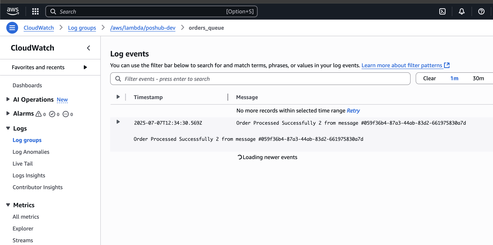
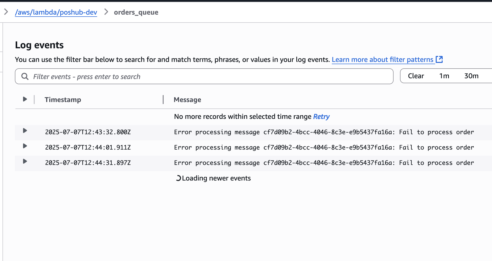
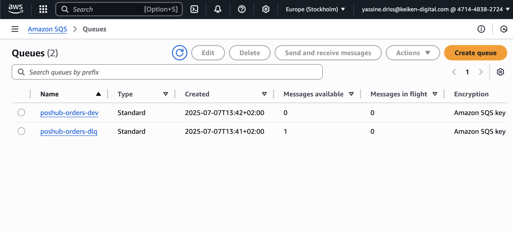

The `sam-min.yaml` template, define all required ressource :
- SQS Queues
- Lambda functions
- IAM Policies

**Important**
```yaml
Ressources:
...
  OrderProcessorFunctionIac:
    ...
    Events:
      OrdersQueue:
        Type: SQS
        Properties:
          BatchSize: 10
          Enabled: true
          Queue: !GetAtt PoshubOrdersQueue.Arn
          FunctionResponseTypes:
            - ReportBatchItemFailures # To properly handle failed orders (amount == -1)
```

When `OrderProcessorFunctionIac` fail to process an order, it return its ID, so it won't be removed from the `poshub-orders-dev` queue, the same process is repeated `maxReceiveCount: 3` times, so it will be sent to the dead queue `poshub-orders-dlq`.

## Testing


Before deplying it, we can test it locally to create a new order (without any edge case)

```bash
sam local invoke FastApiFunctionIac --container-host 127.0.0.1 -t sam-min.yml -e events/sqs-event-create_order.json

# Invoking order_processor.lambda_handler (python3.13)                                                                                                                                                    
# Decompressing /Users/cinex/repo/upskilling/fastapi_lambda/layers/python-deps-layer.zip                                                                                                                  
# PythonDependenciesLayer is a local Layer in the template                                                                                                                                                
# Local image is up-to-date                                                                                                                                                                               
# Building image.....................
# Using local image: samcli/lambda-python:3.13-x86_64-38ee8e3770f1bc0baec63a773.                                                                                                                          
                                                                                                                                                                                                        
# Mounting /Users/cinex/repo/upskilling/fastapi_lambda/src as /var/task:ro,delegated, inside runtime container                                                                                            
# START RequestId: 8380f28e-372d-47b2-ad58-716fa0753525 Version: $LATEST
# [INFO]  2025-07-07T12:34:30.415Z                Found credentials in environment variables.
# [INFO]  2025-07-07T12:34:30.568Z        05811c61-d0a9-4ac9-b9a0-d7813a4dc8ae    Received event with 1 records
# [INFO]  2025-07-07T12:34:30.569Z        05811c61-d0a9-4ac9-b9a0-d7813a4dc8ae    Processing message 059f36b4-87a3-44ab-83d2-661975830a7d: {'date': '2025-06-26 10:32:43', 'source': 'aws cli', 'order': {'orderId': '2', 'createdAt': '1750933963', 'totalAmount': 380, 'currency': 'USD'}}
# [INFO]  2025-07-07T12:34:30.569Z        05811c61-d0a9-4ac9-b9a0-d7813a4dc8ae    Processing message from aws cli at None
# [INFO]  2025-07-07T12:34:30.861Z        05811c61-d0a9-4ac9-b9a0-d7813a4dc8ae    Successfully processed message 059f36b4-87a3-44ab-83d2-661975830a7d
# END RequestId: 05811c61-d0a9-4ac9-b9a0-d7813a4dc8ae
# REPORT RequestId: 05811c61-d0a9-4ac9-b9a0-d7813a4dc8ae  Init Duration: 1.01 ms  Duration: 1390.45 ms    Billed Duration: 1391 ms        Memory Size: 512 MB     Max Memory Used: 512 MB
# {"statusCode": 200, "body": "{\"message\": \"Successfully processed 1 messages\"}"}
```

we can verify that everything is working well using `orders_queue` log stream in `/aws/lambda/poshub-dev` log group.



If we try to pass negative amount, using `events/sqs-event-negative-amount.json` event, we get something like this :

```bash
sam local invoke OrderProcessorFunctionIac  --container-host 127.0.0.1 -t sam-min.yml -e events/sqs-event-negative-amount.json

# Mounting /Users/cinex/repo/upskilling/fastapi_lambda/src as /var/task:ro,delegated, inside runtime container                                                                                           
# START RequestId: 00198e86-781b-4d97-88d3-55da80671e70 Version: $LATEST
# [INFO]  2025-07-07T12:38:42.224Z                Found credentials in environment variables.
# [INFO]  2025-07-07T12:38:42.349Z        348f594b-e4c8-4c59-a568-12e2882d938c    Received event with 1 records
# [INFO]  2025-07-07T12:38:42.350Z        348f594b-e4c8-4c59-a568-12e2882d938c    Processing message 059f36b4-87a3-44ab-83d2-661975830a7d: {'date': '2025-06-26 10:32:43', 'source': 'aws cli', 'order': {'orderId': '2', 'createdAt': '1750933963', 'totalAmount': -1, 'currency': 'USD'}}
# [ERROR] 2025-07-07T12:38:42.350Z        348f594b-e4c8-4c59-a568-12e2882d938c    Error in process_message: Fail to process order 2 from message #059f36b4-87a3-44ab-83d2-661975830a7d beacause must be totalAmount != -1
# [ERROR] 2025-07-07T12:38:42.643Z        348f594b-e4c8-4c59-a568-12e2882d938c    Error processing message 059f36b4-87a3-44ab-83d2-661975830a7d: Fail to process order
# END RequestId: 348f594b-e4c8-4c59-a568-12e2882d938c
# REPORT RequestId: 348f594b-e4c8-4c59-a568-12e2882d938c  Init Duration: 0.34 ms  Duration: 1200.53 ms    Billed Duration: 1201 ms        Memory Size: 512 MB     Max Memory Used: 512 MB
# {"batchItemFailures": [{"itemIdentifier": "059f36b4-87a3-44ab-83d2-661975830a7d"}]}
```


2. Deploy the template
```bash
sam deploy --template-file sam-min.yml --stack-name poshub-app-sqs --s3-bucket poshub-dev-bucket  --capabilities CAPABILITY_IAM --parameter-overrides ParameterKey=JwtSecret,ParameterValue=a-string-secret-at-least-256-bits-long
```

3. Testing (With amount == -1)

Since, FastAPI apply `ge = 0` condition on the `amount` field, we can bypass it and directly insert a order in the `poshub-orders-dev` queue with `amount == -1`

```bash
aws sqs send-message \
  --queue-url https://sqs.eu-north-1.amazonaws.com/471448382724/poshub-orders-dev \
  --message-body '{ "date": "2025-11-11 02:32:43", "source": "aws cli", "order": { "orderId": "7", "createdAt": "1750933963", "totalAmount": -1, "currency": "USD" } }'

# {
#     "MD5OfMessageBody": "c82ea93a078f53e9fb1c435944f5e6f2",
#     "MessageId": "cf7d09b2-4bcc-4046-8c3e-e9b5437fa16a"
# }
```

This will trigger the `OrderProcessorFunctionIac` lambda function to process the created order, which will fail for 3 times as shown in the figure below :



After failing 3 times to process the message, it will be redirected to the dead queue as shown in the figure below :

